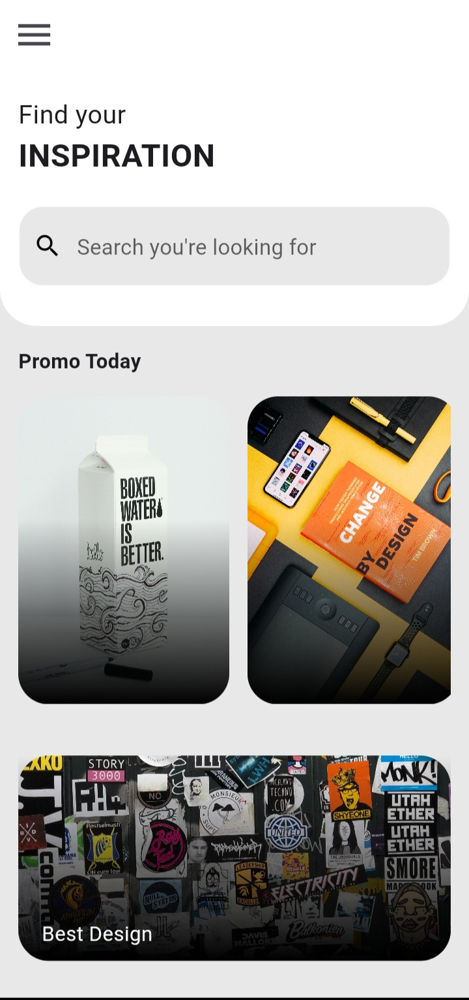

# day_1_app

50 days flutter UI challenge

## Development Setup
Clone the repository and run the following commands:
```
flutter pub get
flutter run
```

## ScreenShots

 

## Links

* [Challenge day one tuto by afgprogrammer](https://www.youtube.com/watch?v=zTTP8XBR6fI)
